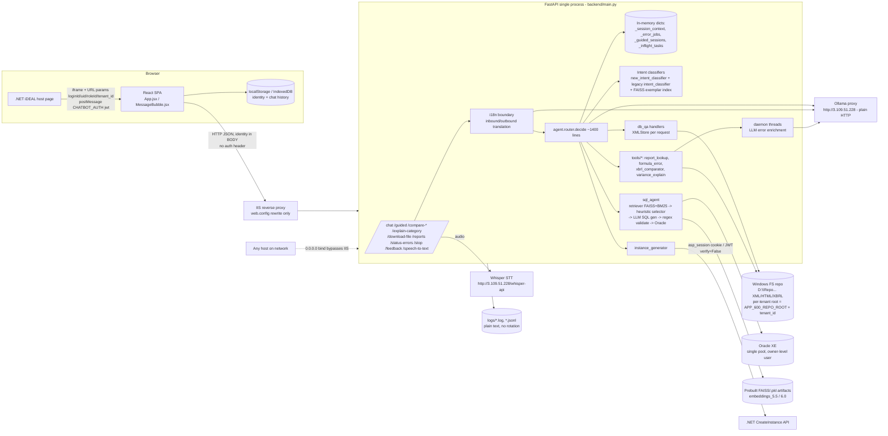

# iDEAL Report Assistant (IntegratedChatBot) — Code Review Report

| | |
|---|---|
| **Review date** | 2026-09-29 |
| **Branch / commit** | `11-final_chatbot` @ `aa17d85` |
| **Scope** | Entire repository: `backend/` (FastAPI, ~84k lines of Python incl. tests), `frontend/` (React/Vite), `eval/`, root scripts, config, docs |
| **Method** | Followed `doc/fastapi_rag_code_review_guide.md` §0–§17. Static reading of the code plus targeted verification: an offline call to the SQL validator using hand-written SQL, and a run of the pytest suite. No code or logic was changed. |
| **Secret handling** | Credentials found in the repo are referenced by file and line only. Their values are **redacted** in this report. |

> **Note on scope vs. the guide.** The guide targets a classic "upload documents → chunk → embed → answer" RAG bot. This system is different: an **intent-routed regulatory-reporting assistant**. Its "retrieval" parts are:
> 1. a **text-to-SQL agent** that runs FAISS + BM25 retrieval over Oracle schema, column and QA-pair indexes, then generates SQL with an LLM (sqlcoder / qwen via Ollama) and executes it on Oracle;
> 2. **XML "application DB" Q&A** over iDEAL master-data files;
> 3. **LLM-explained XBRL validation errors and variance summaries**, grounded in taxonomy and instance files.
>
> Document ingestion (§3) happens offline in a separate repo. Only prebuilt artifacts are shipped here. Guide sections are mapped onto these components as appropriate.

---

## 17.1 Executive Summary

The codebase is large, has detailed comments explaining design rationale, and contains a lot of careful engineering:
- deterministic entity extraction, with the LLM used only as a whitelisted intent classifier;
- grounding gates on LLM error explanations;
- placeholder-safe translation;
- hybrid RRF retrieval;
- per-request tenant contextvars;
- over 3,000 automated tests.

However, the **security model is not production-grade**. The API has **no authentication**. Every identity attribute (`login_id`, `user_id`, `role_id`, `tenant_id`) is taken from the request body or query string and trusted as-is, so any caller can impersonate any user, claim the admin role, or pick any tenant. The problems compound:
- a client-supplied file path (`/explain-category`) and a client-supplied `tenant_id` are both joined straight into filesystem paths;
- the LLM-generated SQL validator can be bypassed (verified offline) and nothing enforces read-only access at the database level;
- plaintext Oracle credentials are committed to git.

Reliability is also affected: a synchronous LLM call on the event loop, all state held in process memory, and 25 failing tests on the current branch.

**Production-readiness verdict: ❌ Not ready.** The P0 items below must be fixed before any exposure beyond a trusted, network-isolated pilot.

**Top 3 risks**
1. **Identity spoofing, privilege escalation and cross-tenant access.** The API has no authentication, trusts client-sent `role_id`/`login_id`/`tenant_id`, and joins `tenant_id` into filesystem paths (C-02, C-03).
2. **Data exfiltration through the LLM → SQL → Oracle path.** The regex validator can be bypassed, there is no read-only DB user, no row or tenant scoping, and user text goes into the prompt unescaped (C-05, H-02).
3. **Leaked credentials and arbitrary file read.** Oracle passwords are committed in `backups/`, and `/explain-category` parses any server path the client sends (C-01, C-04).

### Scorecard

| Area | Score (1–5) | Summary |
|---|---|---|
| Folder structure & modularity | 2 | Reasonable top-level packages, but god modules (`report_lookup.py` 4,846 lines, `new_intent_classifier.py` 4,456, `decide()` ~1,400 lines). Two live intent classifiers and dispatchers, ~1,000+ lines of dead code, generic `src` package injected onto `sys.path`. |
| Architecture & scalability | 2 | Single process holding all session, job and in-flight state in memory with no TTL. No queue for background LLM work (unbounded daemon threads). No streaming. Only works as a single worker. |
| RAG ingestion (offline artifacts) | 2 | Artifacts are built out-of-repo. `build_stamp.json` checksums are never checked. The 6.0 stamp lists 17 files but only 11 are present. The intent index is stale (374 vectors vs 618 exemplars). Pickle is used for metadata. |
| RAG retrieval | 3 | Good: hybrid dense + BM25 with RRF, score floors, QA re-ranking, query embedded once, model loaded once. Missing: FAISS ↔ metadata consistency checks, embedding-model stamp, token budget. |
| RAG generation & prompting | 2 | Strong grounding gates for error explanations and variance summaries. But prompts are inline f-strings, unversioned, and user text is not delimited. DB Q&A "beautified" output is ungrounded. The prompt and the intent validator disagree, leaving dead branches. |
| RAG evaluation | 3 | Real eval harnesses exist (model bench, multilingual, STT) with golden sets, but none run in CI and there are no regression thresholds. The SQL agent's eval is excluded from the repo. |
| FastAPI design | 2 | Lifespan warm-up is done well and Pydantic bounds exist on most fields. But there are no `Depends`/auth, no versioning, blocking I/O inside `async def`, manual `__enter__`/`__exit__`, docs exposed, and a liveness-only health endpoint. |
| Code quality & standards | 3 | ~97% of functions have type annotations, no bare `except:`/`eval`/mutable defaults, and comments explain "why". But there are many broad `except Exception` handlers, 53 `.get(k,"").lower()` calls that crash on `None`, magic numbers, and no linter or formatter configured. |
| Performance | 2 | A synchronous `requests` LLM call and embedding inference run on the event loop. All XML files are re-parsed every request (the cache is per instance). A new httpx client is created per call. No global LLM concurrency limit. |
| Security (API/infra) | 1 | No authentication, client-asserted identity, tenant path injection, arbitrary file read, IDOR on downloads, committed DB credentials, `verify=False`, bound to 0.0.0.0, no security headers or rate limits. |
| Security (LLM/RAG) | 1 | SQL validator bypass (verified), no DB least privilege or tenant scoping, prompt injection in SQL and beautifier prompts, forged `assistant` history turns accepted, denial-of-wallet exposure on unauthenticated endpoints. |
| Error handling & resilience | 3 | The global handler hides internals, and the fail-safe translation and outage circuit breaker are good. Weak points: ad-hoc retries (including on 4xx), `/stop` does not stop threads, no fallback model, several fail-open paths. |
| Logging & observability | 2 | Centralised stdlib logging with good process-identity lines. But logs are plain text, there is no request-ID propagation, no rotation or retention, PII and query text are persisted, and there are no metrics or tracing. |
| Config, data & DB | 2 | Seven config modules read with `os.getenv` at import time. No pydantic-settings or `SecretStr`. `.env.example` is missing 69 of 95 variables. Some required values do fail fast (good). |
| Testing | 3 | 3,042 passing tests, including tenant-isolation and resilience tests. But 25 fail, the suite needs a hand-edited `.env`, tests depend on real LLM and `D:\` data, and there are no SQL-agent, auth-bypass or prompt-injection tests. |
| DevOps & documentation | 1 | No CI, Dockerfile, lockfile, pre-commit or root README. Runtime logs and eval outputs are committed. Rich design docs exist in `doc/`, but there is no runbook. |

---

## 17.2 As-Built Architecture



### Gaps vs. the reference architecture (§2.1)

| Reference component | As built | Gap |
|---|---|---|
| Auth / RBAC at gateway or API | None. Identity comes from the request body, and the role is looked up in XML only when absent | **Critical** |
| Stateless API + Redis | All state in process memory, no TTL | High (blocks scale-out and restarts lose state) |
| Queue + workers for heavy/async work | `threading.Thread(daemon=True)` per request | High |
| LLM provider abstraction + fallback | `llm_service`, `error_llm`, `beautifier`, `sql_generator` and `translator` each call Ollama directly, with 4 different default URLs. No fallback model. `config/llm_models.yml` is unused | Medium |
| Mandatory tenant filter on retrieval | Tenant = filesystem root chosen by the client. The SQL agent is not tenant-aware at all | **Critical / High** |
| Streaming | None (an unused `stream_db_qa_beautifier` exists) | Info |
| Rate limits / quotas | None | Medium |
| Observability (metrics, traces, LLM tracing) | Plain logs only | Medium |
| Object storage for raw docs | Local Windows filesystem | Info (acceptable for an on-prem design, but it ties the API to one host) |

### Traced chat request (`POST /chat`)
In the list below, **(B)** marks a blocking call made on the event loop.

1. `main.py:336` `chat()` builds the repo scope from the client's `tenant_id` (`main.py:357` → `version_config.py:104-118`) and enters it manually (`main.py:358`).
2. `i18n.translate_inbound` runs (async httpx). If the translation fails, the turn is refused (`main.py:369-378`). **Good.**
3. `decide()` (`agent/router.py:54`):
   - auth XML lookup of the client-sent `login_id` **(B)** (`:89`);
   - role taken from the body when present, otherwise from XML **(B)** (`:125-127`);
   - regex classification (`:903`);
   - semantic tier: SentenceTransformer encode + FAISS **(B, CPU)** (`new_intent_classifier.py:2837`);
   - DB Q&A: `handle_db_qa_query` (sync) → `beautifier.py:83` `requests.post(timeout=120)` **(B, up to 120 s)**;
   - SQL agent via `asyncio.to_thread` (OK);
   - LLM intent extraction (async httpx, OK);
   - status lookups: XML parse **(B)**, which also spawns a daemon thread that makes LLM calls.
4. `translate_outbound` (async), then `ChatResponse(**result)`. No streaming and no disconnect handling.

---

## 17.3 Findings

IDs use the prefixes C (Critical), H (High), M (Medium), L (Low) and I (Info). Each finding lists its guide checklist reference. **"Verified"** means the claim was confirmed by executing code or by checking it directly during this review. The other findings are cited from reading the source.

### Critical

#### [C-01] Plaintext Oracle database credentials committed to git
- **Severity:** Critical · **Category:** Security · **Checklist:** §1.2.10, §10.2.1
- **Location:**
  - `backups/.env.deployment:76-81`: `ORACLE_DSN`, `ORACLE_USER`, `ORACLE_PASSWORD=***REDACTED***` for a public IP on 1521/XE
  - `backups/.env.bak.20260917`: `DV_DB_HOST_60/…/DV_DB_PASSWORD_60=***REDACTED***` for a second public IP, plus a commented-out `ORACLE_PASSWORD`
  - Both files have been tracked since commit `fd20148`.
- **Issue:** `.gitignore` excludes `.env`, `.env.local` and `.env.*.local`, but not `.env.bak.*`, `.env.deployment` or the `backups/` folder. These files also expose internal and public IPs, CORS origins and a customer schema name.
- **Impact:** anyone with repo access, or any clone or backup of it, holds working DB credentials for a bank-named schema on internet-reachable hosts. Likelihood is high if the repo has been pushed to any shared remote.
- **Recommendation:**
  1. **Rotate both passwords immediately.**
  2. `git rm --cached backups/.env*` and purge them from history (`git filter-repo --path backups/ --invert-paths`).
  3. Add ignore rules and a secret scanner (gitleaks) as a pre-commit hook and a CI step.
- **Suggested code (`.gitignore`):**
  ```gitignore
  .env*
  !.env.example
  backups/
  ```
- **Effort:** S (plus coordination for the rotation)

#### [C-02] No authentication; identity and role are client-asserted, so a caller can impersonate anyone and become admin
- **Severity:** Critical · **Category:** Security · **Checklist:** §10.1.1, §10.1.3, §10.1.4, §7.4.2
- **Location:**
  - `backend/main.py:336-1097`: no route uses `Depends` or auth middleware.
  - `backend/models.py:12-29`: `login_id`, `user_id`, `role_id`, `tenant_id`, `jwt`, `asp_session` are all optional body fields.
  - `backend/agent/router.py:84-130`
  - `backend/agent/db_qa_router.py:589-598`
- **Issue:**
  ```python
  # db_qa_router.py:594-598
  _provided_role = role_id if role_id and role_id != "0" else None
  effective_role_id = _provided_role or (resolved_user.get("RoleId") ...)
  is_admin = (effective_role_id == config.APP_DB_ADMIN_ROLE_ID)   # default "101"
  ```
  - The client's `role_id` wins over the XML role. `router.py:125` only looks up the XML role when `role_id` is empty or `"0"`.
  - `login_id` is looked up in XML but never proven: no JWT signature check, and no check of the ASP.NET session against .NET. The JWT is only forwarded to .NET for instance generation.
  - The debug text at `main.py:350` claims `role_id` is "NOT SENT — resolved inside decide()". That is false, because `main.py:389` forwards `request.role_id`.
- **Impact:**
  - `POST /chat {"message":"list all users","role_id":"101"}` unlocks the ~25 admin-only DB Q&A answers (users, departments, roles, audit data).
  - Sending another user's `login_id` gives you their form ACL and their instance-generation rights.
  - Exploitable by anyone who can reach the API (see H-07).
- **Recommendation:**
  - Add one auth dependency on every non-health route that validates a server-verifiable credential and derives identity from it. For 6.0, verify the JWT signature, `exp`, `aud`/`iss` and a `TenantId` claim. For 5.5, have .NET mint a signed short-lived token, or validate the session server-to-server.
  - Remove `role_id`, `user_id` and `tenant_id` from the request models (`extra="forbid"`).
  - Use `access_control.is_admin()` (which already resolves server-side) on both the legacy and new paths.
- **Suggested code:**
  ```python
  # backend/core/security.py
  class Principal(BaseModel):
      login_id: str; user_id: str; role_id: str; tenant_id: str | None

  async def current_principal(authorization: str = Header(...)) -> Principal:
      claims = jwt.decode(authorization.removeprefix("Bearer "), PUBLIC_KEY,
                          algorithms=["RS256"], audience=AUD, issuer=ISS)
      role = auth_service.get_user_role_id(claims["loginId"])      # server-side
      return Principal(login_id=claims["loginId"], user_id=claims["uid"],
                       role_id=role, tenant_id=claims.get("TenantId"))

  @app.post("/chat")
  async def chat(req: ChatRequest, who: Principal = Depends(current_principal)): ...
  ```
- **Effort:** L

#### [C-03] (6.0) `tenant_id` is trusted as-is and joined into the filesystem root, allowing cross-tenant access and path escape
- **Severity:** Critical · **Category:** Security · **Checklist:** §2.2.7, §4.1, §11.4, §10.3.6
- **Location:** `backend/version_config.py:104-105` and `:118`, reached from `main.py:318-333`. It is used by every route, including `/download-file`, `/reports` and `/allowed-actions`.
- **Issue (verified by reading):**
  ```python
  if tenant_id and tenant_id.strip():
      return tenant_id.strip()                      # trusted verbatim
  ...
  return os.path.join(APP_600_REPO_ROOT, tenant_id) # no validation
  ```
  - Any tenant can be chosen by changing `?tenant_id=`.
  - `os.path.join` **discards the base** when `tenant_id` is absolute (`C:\x`) or UNC (`\\host\share`, which fits in 64 characters). `..\` is not blocked either.
  - The `/download-file` containment check (`main.py:958-968`) is computed against this attacker-chosen root, so it gives no protection here.
- **Impact:**
  - Reads of another tenant's master data, instances and render files.
  - With a UNC root, `auth_service` loads User, Department and RoleAccess XML **from an attacker's share**, so the attacker supplies their own authorization data.
  - SMB access from the service account leaks its NTLM hash.
- **Recommendation:** derive the tenant from the verified token (C-02). Otherwise, at minimum, apply an allowlist regex, require that the tenant exists in `XML_Tenant.xml`, and add a post-join containment check.
- **Suggested code:**
  ```python
  _TENANT_RE = re.compile(r"^[0-9A-Za-z_-]{1,32}$")
  def repo_root_for_tenant(tenant_id: str) -> str:
      if not _TENANT_RE.fullmatch(tenant_id) or tenant_id not in _get_tenant_registry().values():
          raise ForbiddenError("unknown tenant")
      root = Path(APP_600_REPO_ROOT, tenant_id).resolve()
      if not root.is_relative_to(Path(APP_600_REPO_ROOT).resolve()):
          raise ForbiddenError("invalid tenant")
      return str(root)
  ```
- **Effort:** S (validation) / L (token-derived tenant)

#### [C-04] `/explain-category` opens and parses any server path the client supplies (arbitrary file read)
- **Severity:** Critical · **Category:** Security · **Checklist:** §10.3.7, §10.1.3
- **Location:**
  - `backend/models.py:151` `error_file_path: str = Field(..., max_length=1024)`
  - `main.py:720` → `agent/error_explanation.py:72-78` → `tools/report_lookup.py:3730-3749` (`count_errors_by_category`) and `explain_errors_by_category`
- **Issue (verified by reading):**
  ```python
  if not error_file_path or not os.path.isfile(error_file_path): ...
  root = ET.parse(error_file_path).getroot()            # any .xml
  with open(error_file_path, "r", encoding="utf-8", errors="replace") as fh:  # any .html
  ```
  - There is no containment check, unlike `/download-file`.
  - The server returns the absolute path to the browser (`report_lookup.py:4432` `"error_file_path": full_path`), which reveals the layout and invites tampering.
- **Impact:**
  - Any readable XML or HTML file on the host, or on a UNC share, is parsed. Its content feeds LLM explanations that are returned to the caller.
  - Different responses act as a file-existence oracle.
  - Cross-tenant and cross-department error files can be read.
  - UNC paths leak the NTLM hash.
- **Recommendation:** stop accepting paths from the client. Accept `(form_id, filename)` or an opaque ID, rebuild the path with `build_error_file_path`, and apply the same `resolve().relative_to(instance_base_dir())` check plus a form-ACL check.
- **Suggested code:**
  ```python
  class ExplainCategoryRequest(BaseModel):
      model_config = ConfigDict(extra="forbid")
      form_id: str = Field(pattern=r"^\d{1,10}$")
      error_file: str = Field(max_length=255)   # basename only
      ...
  path = Path(build_error_file_path(req.form_id, os.path.basename(req.error_file))).resolve()
  path.relative_to(Path(instance_base_dir()).resolve())   # raises -> 403
  if req.form_id not in who.allowed_form_ids: raise ForbiddenError()
  ```
- **Effort:** M

#### [C-05] The LLM-generated SQL validator can be bypassed and nothing enforces read-only access at the database level
- **Severity:** Critical · **Category:** Security / RAG · **Checklist:** §10.3.5, §11.1, §11.5, §11.6
- **Location:**
  - `backend/sql_agent/src/sql_generator.py:1664-1860` (`validate_sql`), in particular `:1675`, `:1730` and `:15`
  - Prompt construction: `:913`, `:957`, `:690`
  - Execution: `sql_agent/query_handler.py:341-354` and `src/executor.py:26-35`, `:168-172`
- **Issue:**
  - Table references are collected only by `re.findall(r'(?:from|join)\s+([a-z_][a-z0-9_]*)', q)` (`:1730`). Tables after a comma in `FROM a, b` are never checked.
  - String literals are blanked (`:1675`) *before* the keyword and table checks, so SQL hidden inside a string literal passes.
  - Any `AS <name>` alias is exempted from the column and table checks.
  - The blocklist (`:15`) is missing `merge`, `grant`, `call`, `execute`, `begin` and package calls, and comments are not stripped.
  - **Verified offline** (a direct call to `validate_sql` with `cims_ale_q_anx_1_a` as the only allowed table):
    - `SELECT * FROM cims_ale_q_anx_1_a, all_users WHERE rownum < 5` returned `(True, 'Valid')`
    - `SELECT dbms_xmlgen.getxml('select * from all_users') AS getxml FROM cims_ale_q_anx_1_a WHERE rownum = 1` returned `(True, 'Valid')`
  - The user's question is placed into the prompt raw (`f"[QUESTION]{user_query}[/QUESTION]"`), with no neutralising of `[/QUESTION]` or `###`. That gives a practical route to inject such SQL.
  - The executor connects as the configured `DB_USER`, which owns the tables (it queries `USER_TABLES`). There is no `SET TRANSACTION READ ONLY` and no restricted role.
- **Impact:** a prompt-injected question can read any table or view the account can see, including other schemas through `DBMS_XMLGEN`, and possibly exfiltrate data with `UTL_HTTP` if network ACLs allow it. Grants are *needs verification*.
- **Recommendation:**
  1. **Database-level control first:** a dedicated `CHATBOT_RO` user with `SELECT` only on the allowed tables and no `EXECUTE` on `DBMS_*`/`UTL_*`, plus `SET TRANSACTION READ ONLY`.
  2. Replace the regex with AST validation.
  3. Neutralise delimiters in user text and cap its length.
- **Suggested code:**
  ```python
  import sqlglot
  from sqlglot import exp
  def validate_sql_ast(sql: str, allowed: set[str]) -> tuple[bool, str]:
      try:
          tree = sqlglot.parse_one(sql, read="oracle")
      except sqlglot.errors.ParseError:
          return False, "unparseable"
      if not isinstance(tree, (exp.Select, exp.Union)):
          return False, "not a select"
      tables = {t.name.lower() for t in tree.find_all(exp.Table)}
      if tables - allowed:
          return False, "table not allowed"
      if any(isinstance(f.this, exp.Dot) or "." in (f.name or "") for f in tree.find_all(exp.Anonymous)):
          return False, "package call not allowed"
      return True, "Valid"

  q = re.sub(r"\[/?(QUESTION|SQL)\]|^#{2,}", " ", user_query, flags=re.I | re.M)[:500]
  ```
- **Effort:** M (DB user + AST validator), with DBA coordination

---

### High

#### [H-01] Authorization fails open when identity is missing; `REQUIRE_AUTH` defaults to false and gates `/chat` only
- **Severity:** High · **Category:** Security · **Checklist:** §10.1.1, §10.1.4
- **Location:**
  - `agent/router.py:84` `os.getenv("REQUIRE_AUTH", "false")`; `:111`
  - `guided.py:123` `if not login_id: return list(GUIDED_ACTIONS)`; `guided.py:200` `allowed_form_ids = None  # None = no restriction` (no `REQUIRE_AUTH` check in guided mode)
  - `agent/generation.py:139` checks generation rights only `if login_id:`
  - `db_qa/access_control.py:124-132` together with `query_handlers/_return_resolution.py:55-57` (`if allowed is None: return None`, i.e. allow). This contradicts `auth_service.py:118-121`, which documents `None` as "caller should deny".
  - `auth_filters.py:37-38`, `:53-54` treat `None` as "allow all".
  - `REQUIRE_AUTH` and `AUTHORIZATION_ENABLED` are both absent from `.env.example`.
- **Impact:** simply omitting `login_id` bypasses the department form ACL and the instance-generation role check on `/guided`, and on `/chat` wherever `REQUIRE_AUTH` is unset.
- **Recommendation:** fail closed. With C-02 in place, a missing principal gives a 401. Replace the "None = allow all" convention with an explicit `AuthzDisabled` sentinel that is only honoured in a dev build.
- **Effort:** M

#### [H-02] Generated SQL has no tenant, entity or user scoping
- **Severity:** High (Critical if the schema is multi-entity) · **Category:** Security / RAG · **Checklist:** §4.1, §11.4
- **Location:**
  - `sql_agent/query_handler.py:173` `handle_db_query(message, session_id=None)`: no identity parameter, and `session_id` is unused.
  - Callers: `agent/router.py:1094`, `:1152`; `guided.py:353`.
  - Global pool: `src/executor.py:14`. Global `EMBEDDING_DIR`: `_bootstrap.py:182-195`.
- **Issue:** the request's tenant scope (`main.py:357`) is ignored by the SQL agent. No server-side `WHERE` filter is added, and the SQL intent is not role-gated. By contrast, DB Q&A does apply `access_control.scope_query` (`db_qa_router.py:661`).
- **Impact:** every user of every tenant can query every row in the connected schema. **Needs verification:** whether the schema holds data for several banks or entities (for example the `CODE` column).
- **Recommendation:** pass the principal into `handle_db_query`. Enforce scoping in Oracle (VPD/RLS or per-tenant views and users). Gate the intent by role.
- **Effort:** M–L

#### [H-03] Downloads and info endpoints have no object-level authorization
- **Severity:** High · **Category:** Security · **Checklist:** §10.1.3
- **Location:** `main.py:911-978` (`/download-file`), `:981-987` (`/reports`), `:990-1004` (`/allowed-actions`), `:1007-1037` (`/status-errors/{job_id}`)
- **Issue:**
  - `/download-file` sanitises `form_id` and `filename` and checks containment (good), but never checks the form against the caller's allowed forms.
  - Render and error filenames are predictable (`instance_service.py:31`).
  - `/allowed-actions?login_id=` works as a user-enumeration and role oracle.
  - `/reports` lists every report with no department filter.
- **Impact:** any caller can download any form's render (HTML) or error (XML) files, and on 6.0 any tenant's too (see C-03).
- **Recommendation:** require the principal, check `safe_fid in who.allowed_form_ids`, and consider signed download tokens that expire.
- **Effort:** S–M

#### [H-04] Session hijack through a client-chosen `session_id`; stored ASP.NET cookie reused; static cookie fallback; TLS verification disabled
- **Severity:** High · **Category:** Security · **Checklist:** §10.1.3, §10.3.2, §5.3.3
- **Location:**
  - `frontend/src/App.jsx:171` `sessionId = useRef(_uid || crypto.randomUUID())`: the session ID is the predictable uid.
  - `agent/router.py:145-150` `session["asp_session"] = asp_session`, then `effective_asp = asp_session or session.get("asp_session")`.
  - `tools/instance_generator.py:672` `cookie_value = asp_session or _DOTNET_SESSION_COOKIE`.
  - `:698`, `:728`, `:901` use `verify=False`.
  - `:723-735` re-POSTs cookies to any `https://` `Location` host that is not a login URL (the comment says "same host", but nothing checks it).
  - `:677-679` logs the first 16 characters of the session cookie.
- **Impact:**
  - Anyone who knows a victim's session ID can drive that victim's in-flight workflow, including instance generation with the victim's stored cookie, and comparisons (`comparison.py:545`).
  - With `DOTNET_SESSION_COOKIE` set, unauthenticated callers generate instances as the service account.
  - The cookie is exposed to a man-in-the-middle.
- **Recommendation:**
  - Mint session IDs on the server, bound to the principal and tenant.
  - Never store forwarded credentials in session state.
  - Remove the static cookie fallback outside dev.
  - Set `verify=True` (with the internal CA bundle).
  - Follow a redirect only when scheme, host and port match `_DOTNET_URL`.
  - Stop logging cookie prefixes.
- **Effort:** M

#### [H-05] Blocking calls on the event loop, including a synchronous `requests` LLM call of up to 120 s
- **Severity:** High · **Category:** Performance · **Checklist:** §7.3.3, §7.3.4, §9.1
- **Location:**
  - `agent/router.py:1063` (and `:465`, `guided.py:328`) call the sync `handle_db_qa_query` (`db_qa_router.py:527`), which reaches `db_qa/beautifier.py:83-93` `requests.post(..., stream=True, timeout=120)`. **Verified by reading.**
  - `APP_DB_ENABLE_BEAUTIFY` defaults to `"true"` (`config.py:194`).
  - Also blocking: `new_intent_classifier.py:2837` (`classify_by_embedding`, a BGE-large encode), XML parsing throughout `decide()` (`router.py:89`, `:127`, `:1002`, `:1010`), `agent/generation.py:37`, `:102`, `:192`, `scheduler_queue_service.py:131-172`, `/reports` and `/allowed-actions`, and the CPU work in `/compare-summary` (`variance_explain.py:1204-1210`).
- **Impact:** while one user's answer is beautified, **every** request in the process stalls, including `/stop`, `/health` and translations. `/stop` cannot cancel it because there is no `await` point.
- **Recommendation:** wrap sync work in `await asyncio.to_thread(...)`, or declare the purely synchronous routes as `def`. Move the beautifier to async `httpx`.
- **Suggested code:**
  ```python
  db_result = await asyncio.to_thread(
      handle_db_qa_query, message=user_query, intent=db_intent, params=db_params, ...)
  sem = await asyncio.to_thread(classify_by_embedding, question)
  ```
- **Effort:** S–M

#### [H-06] `run_in_executor` drops the per-request tenant contextvars (6.0)
- **Severity:** High · **Category:** Correctness / Security · **Checklist:** §11.4
- **Location:**
  - `agent/error_explanation.py:70-80` `loop.run_in_executor(None, explain_errors_by_category_for_form, ...)`
  - Nested `ThreadPoolExecutor`s at `tools/report_lookup.py:3552-3558` and `formula_error_generic.py:1069`
- **Issue:** unlike `asyncio.to_thread`, `loop.run_in_executor` does **not** copy contextvars. `config._active_root()` (`config.py:73`) reads the tenant root from a contextvar, so code running in the executor sees the default root. `background_jobs.py:141-151` documents this exact bug and fixes it for threads, but it was not fixed here.
- **Impact:** taxonomy and metadata lookups during error explanation can resolve against the wrong (shared or base) root, giving wrong explanations or cross-tenant reads.
- **Recommendation:** `await asyncio.to_thread(...)`, and use `contextvars.copy_context().run` when submitting to the inner pools.
- **Effort:** S

#### [H-07] Backend exposure: bound to 0.0.0.0, OpenAPI docs public, LLM/STT traffic in plaintext to a public IP
- **Severity:** High · **Category:** Security / DevOps · **Checklist:** §7.1.5, §10.3.2, §16.3.5
- **Location:**
  - `service_server.py:36` and `dev_server.py:56` use `host="0.0.0.0"` (**verified**), while IIS proxies to `127.0.0.1:8002` (`frontend/public/web.config:13`).
  - `main.py:209`: `FastAPI(...)` with default `docs_url`, `redoc_url` and `openapi_url`.
  - `sql_agent/src/config.py:94` default `http://3.109.51.228/OllamaProxy/api/generate`; `stt/config.py:15` default `http://3.109.51.228/whisper-api`.
- **Impact:**
  - Direct access that bypasses IIS, which makes C-02 through C-04 remotely exploitable.
  - The published schema documents the exploitable fields.
  - User questions, report data and voice recordings travel unencrypted to an external host.
- **Recommendation:** bind to `127.0.0.1` and firewall the port. Set `docs_url=None, redoc_url=None, openapi_url=None` outside dev. Use HTTPS or a private network, and remove the hardcoded IP defaults (fail if unset).
- **Effort:** S

#### [H-08] No Oracle query timeout; the row limit caps the fetch, not the server-side work
- **Severity:** High · **Category:** Reliability / Security · **Checklist:** §4.12, §12.1.8, §11.11
- **Location:** `sql_agent/src/executor.py:168-172` (`cursor.execute(sql)` followed by `fetchmany(DB_MAX_ROWS)`). `call_timeout` is not set anywhere. The pool max is 10 (`:32`).
- **Impact:** a cross join or heavy aggregate runs to completion. It holds a worker thread and one of 10 pooled connections indefinitely, and `/stop` does not stop the thread. Truncation at 100 rows is not reported to the user.
- **Recommendation:**
  ```python
  conn.call_timeout = 30_000
  cursor.execute(f"SELECT * FROM ({stmt}) FETCH FIRST {DB_MAX_ROWS + 1} ROWS ONLY")
  rows = cursor.fetchall(); truncated = len(rows) > DB_MAX_ROWS
  ```
- **Effort:** S

#### [H-09] "Beautified" DB Q&A output replaces the deterministic answer with no grounding check, and the prompt is injectable
- **Severity:** High · **Category:** RAG / LLM security · **Checklist:** §5.1.2, §5.1.3, §5.4.3, §11.10
- **Location:** `agent/db_qa_router.py:705-708` (`response_dict["response_text"] = full_response`); `db_qa/beautifier.py:19-20`, `:37-40`, `:54-61`
- **Issue:**
  - The records are truncated to 30 items and 6,000 characters, which cuts mid-JSON, yet the prompt still says `Records ({len(records)} total)`.
  - The user question is concatenated into the same `/api/generate` prompt as the rules, with no delimiter.
  - Temperature is 0.3.
- **Impact:** the model can invent or drop users and roles, or state counts that are not in the data, in a regulatory context. A user can also steer the output.
- **Recommendation:**
  - Keep the deterministic `_format_plain` as the primary answer, or run a numbers-and-names grounding check against the records (reuse `tools/error_llm.collect_numbers` / `is_grounded`).
  - Use chat messages with the data fenced in `<data>` and marked untrusted.
  - Never truncate JSON mid-structure, and use temperature 0.
- **Effort:** M

#### [H-10] Expensive LLM enrichment starts before the authorization check (denial of wallet and data computation)
- **Severity:** High · **Category:** Security / Cost · **Checklist:** §11.11, §10.1.3
- **Location:** `agent/router.py:1010-1012` (also `:964-966`, `:1450-1452`); `agent/background_jobs.py:152-183`
- **Issue:** `_get_status_fast_with_bg_job(...)` spawns a daemon thread that makes N LLM calls. Only after that does `_apply_auth_to_status_result(...)` run.
- **Impact:** unauthorised users can trigger unbounded LLM spend, and other departments' error details get computed and cached in `_error_jobs`.
- **Recommendation:** check `form_id in allowed_form_ids` before calling `_start_error_enrichment_thread`.
- **Effort:** S

#### [H-11] Self-scoped DB Q&A questions can return other departments' or users' data
- **Severity:** High · **Category:** Security · **Checklist:** §10.1.3
- **Location:**
  - `db_qa/query_handlers/return_handlers.py:1355-1360` (`handle_nonxbrl_return_list` filters by `entities["target_department"]` before checking `target_type == "self"`)
  - `audit_handlers.py:124-133` (the cross-validation branch returns all users' entries and ignores `allowed_form_ids`)
  - `audit_handlers.py:74-86` (latent `failed_login_exceeded` / `deactivated` branches)
  - `access_control.py:87` defaults a missing `target_type` to `"self"`, and the handlers "never re-check" (`user_handlers.py:5-6`, `dispatcher.py:12-14`)
- **Example:** "show my non-XBRL returns for Treasury department" is classified as `self` and returns Treasury's list, labelled "My Non-XBRL Returns".
- **Recommendation:**
  - Apply the self filter first in every handler.
  - In `scope_query`, enforce `target_type ∈ INTENT_SPECS[intent].target_types` and never default to `self` when the spec does not allow it.
  - Add regression tests.
- **Effort:** M

#### [H-12] 6.0 crash: menu queries raise `AttributeError` (`None.lower()`)
- **Severity:** High · **Category:** Correctness · **Checklist:** §8.3
- **Location:** `db_qa/versions/v6_0_schema.py:141` (`"IsMenu": None`); `versions/loader.py:51-62` (the key is always emitted with value `None`); `query_handlers/menu_handlers.py:19` and `legacy.py:681` (`o.get("IsMenu", "").lower()`). **Verified by reading.**
- **Issue:** the key is present, so the `""` default never applies. The same pattern occurs in 53 `.get("X", "").strip()/.lower()` calls, for example `user_handlers.py:140` `u.get("LastLoginDT", "").strip()`.
- **Recommendation:** have the loader emit `""` for missing or unmapped attributes, or use a `get_str(row, key)` helper `(row.get(key) or "")`.
- **Effort:** S

#### [H-13] The LLM intent prompt and the validator disagree, so the `db_*` branch is dead
- **Severity:** High · **Category:** Correctness / RAG · **Checklist:** §5.2.6
- **Location:** `services/llm_service.py:61-81` (the prompt lists `db_my_profile`, `db_list_users`, … and 8 entity fields) versus `llm_extractor.py:1047-1051`, whose `_valid_intents` has only six values and no `db_*`
- **Impact:** `agent/router.py:1122-1148` (`if intent.startswith("db_")`) can never run. DB questions the model classifies correctly are reset to "unknown", so users get "didn't understand". The discarded entity fields waste tokens and latency on every call.
- **Recommendation:** generate the prompt's intent list and the validator from one shared `Enum`, and shrink the requested schema to `{"intent": ...}`.
- **Effort:** S

#### [H-14] The test suite is not reproducible and the branch is red (25 failures)
- **Severity:** High · **Category:** Testing · **Checklist:** §15.10, §16.2.1
- **Evidence (verified by running):**
  - `pytest -q` gives **45 collection errors**, all `RuntimeError: BACKEND_PORT is not set` (`backend/config.py:15-25`), plus `scripts/debug/query_test.py`, which is collected by accident.
  - With `BACKEND_PORT=8001 --ignore=scripts`: **3,042 passed, 25 failed, 245 skipped, 1 xfailed** (333 s).
  - Failures:
    - 12 in `test_formula_explanation_wording.py` / `test_error_card_v2.py`, matching the latest "explanation reframe" commits;
    - 10 from drift in real `D:\` data;
    - 3 from the classifier or the live LLM.
  - Live-LLM tests (`test_department_semantic_paraphrasing.py:133-160`, `test_error_explanation_v2.py`) call whatever `OLLAMA_BASE_URL` `.env` points to. In this run that was the remote proxy.
  - Around 170 skips are "real data tree not present".
- **Recommendation:**
  - Add `pytest.ini`/`pyproject.toml` with `testpaths = backend eval`, `asyncio_mode`, and markers `live` / `realdata` that are skipped by default.
  - Set test environment defaults in `conftest.py` before importing the backend.
  - Commit small sanitised XML fixtures.
  - Triage the 12 error-card failures before merging to `main`.
- **Effort:** M

#### [H-15] No CI/CD, containerisation, linting or secret scanning
- **Severity:** High · **Category:** DevOps · **Checklist:** §8.1.5, §10.5, §16.1, §16.2
- **Evidence:** none of these exist: `.github/`, `azure-pipelines.yml`, `Dockerfile`, `.dockerignore`, `pyproject.toml`, `pytest.ini`, `Makefile`, `.pre-commit-config.yaml`. ruff, bandit and pip-audit are not installed. The frontend has no lint or test scripts.
- **Impact:** tests, evals and secret scans never run automatically. That is how C-01 and the red branch (H-14) went unnoticed.
- **Recommendation:** a minimal pipeline of install → ruff → pytest (non-live) → bandit → pip-audit → gitleaks, plus a pre-commit hook with a secret scanner.
- **Effort:** M

#### [H-16] The highest-risk component (the SQL agent) has no tests
- **Severity:** High · **Category:** Testing · **Checklist:** §15.1, §15.6
- **Evidence:** there are no test files under `backend/sql_agent/`, and no test covers `validate_sql`, DDL/DML rejection, comment tricks, schema escape or prompt injection. The SQL-agent eval folder is gitignored (`.gitignore:73`).
- **Recommendation:** add a validator unit-test table (including the two bypass strings from C-05) and adversarial prompt cases, both mocked and live-marked.
- **Effort:** M

#### [H-17] The intent embedding index is stale and nothing checks for it
- **Severity:** High · **Category:** RAG · **Checklist:** §3.4.1, §3.4.2
- **Location:** `db_qa/intents/output/intent_exemplar_meta.pkl` (374 vectors) versus `intents/exemplars.py` (618 phrasings across 56 intents); `embedding_index.py:95-108` does not compare them. The artifacts are gitignored and rebuilt by hand.
- **Impact:** about 40% of exemplars never take part in semantic matching, and the thresholds (`MIN_SCORE=0.80`, `CONFIDENT_SCORE=0.85`) were tuned on a different corpus.
- **Recommendation:** store a hash of the exemplars (and the model name) in the metadata. Rebuild or fail loudly at startup when it does not match, and build the index in the deploy pipeline.
- **Effort:** S

---

### Medium

| ID | Title | Location | Issue / Impact | Recommendation | Effort |
|---|---|---|---|---|---|
| M-01 | All state held in process memory, no TTL (§2.2.2) | `agent/state.py:21,40`, `guided.py:92`, `main.py:217,224` | `_session_context`, `_error_jobs`, `_guided_sessions` and `_inflight_tasks` grow without bound. Everything is lost on restart. More than one worker breaks `/stop`, polling and compare. A job whose row lookup fails stays "pending" forever (`background_jobs.py:74-85`). | Redis, or `cachetools.TTLCache` for now. Document single-worker as a hard constraint. | M |
| M-02 | Unbounded daemon threads for LLM enrichment (§7.3.6, §12.1.13) | `agent/background_jobs.py:152-157`; `report_lookup.py:3552-3558` | One thread per status lookup, each with its own pool, so N requests produce N×k concurrent 300 s Ollama calls. Threads die silently on restart. | One process-wide bounded executor or queue plus a global semaphore. | M |
| M-03 | No process-wide LLM concurrency limit; the STT semaphore queues instead of rejecting (§11.11) | `i18n/boundary.py:814,973` (semaphores created per call); `main.py:232,834` | A few slow requests saturate the Ollama proxy. The comment says a third STT caller "is told to retry", but callers actually queue indefinitely. | A module-level `asyncio.Semaphore` around every Ollama call. `if _stt_slots.locked(): raise 429`. | S |
| M-04 | `conversation_history` is unbounded and forged `assistant` turns are accepted (§7.4.1, §11.1) | `models.py:14`; `main.py:393`; `llm_service.py:197-201,424-428` | Only the count is sliced. The text of each item is uncapped and `role` is unchecked, which allows prompt injection through fake assistant turns and oversized prompts. | Typed `HistoryItem(role: Literal["user","assistant"], text: str = Field(max_length=2000))` with `max_length=7` on the list. | S |
| M-05 | `/compare-summary` runs the LLM on client-supplied rows, unauthenticated, with a 300 s budget | `main.py:556-634`; `models.py:138` (2,000 rows) | The output is "grounded" in facts the attacker supplied. CPU work runs on the event loop. | Key it on the server-side comparison session, rate-limit it, and run it in `to_thread`. | M |
| M-06 | Some SQL that fails the Oracle dry run still executes | `sql_agent/query_handler.py:309,341-354` | `generate_sql`'s `is_valid` / `validation_reason` (which include the EXPLAIN PLAN result) are ignored. | `if not result.get("is_valid"): return ...` | S |
| M-07 | Generated SQL and validation reasons are returned to the client | `query_handler.py:91,254-255,347-348`; `sql_generator.py:1685` | Discloses the schema, and the exact failed check gives an attacker a feedback loop for tuning C-05 payloads. | Show a generic message; show `db_sql` only behind an admin/debug flag. | S |
| M-08 | `pickle.load` on retrieval artifacts; `build_stamp.json` checksums never verified | `sql_agent/src/retriever.py:289-292`, `lexical_search.py:137-138`, `description_fetcher.py:117-128`, `db_qa/intents/embedding_index.py:106-107`; `query_handler.py:242-259` runs "gold SQL" from `qa_meta.pkl` | Anyone who can write to the embeddings directory gets code execution. Stored SQL gets only the weak validator. | JSON / `.npz` metadata; verify SHA-256 against the stamp before loading; apply the AST validator to stored SQL. | M |
| M-09 | No FAISS index/metadata consistency check or model stamp; 6.0 artifacts incomplete (§3.4.1) | `src/retriever.py:296-315`; `embeddings_6.0/build_stamp.json` (17 files listed, 11 present); `embeddings_5.5` has no stamp | A mismatched rebuild gives silent misattribution or `IndexError`. Missing files silently disable signals, and the `None` result is cached forever (`lexical_search.py:134-135`). | At startup assert `index.ntotal == len(meta)` and `index.d == model dim`, check the model name in the stamp, and log missing files loudly. | S |
| M-10 | No prompt token budget; static rules sit first and are lost when Ollama truncates (§4.8) | `sql_generator.py:910-912,1303,1400,~1455` | Silent quality degradation on long retry prompts. | Count tokens before the call, trim columns and labels to a budget, and warn when `prompt_eval_count >= num_ctx`. | S |
| M-11 | Stop and cancellation gaps (§5.2.7) | `main.py:244-262,864-885`; `generation.py:197-203` | `/stop` is unauthenticated and a non-dict body gives a 500. The ID is unregistered between hops, so a Stop between them is lost. Threads are not cancelled. A Stop after the .NET generate call returns "stopped" even though the side effect happened. No `is_disconnected()` check. | Register once per request lifetime, `asyncio.shield` the generate call, bind `request_id` to the session, and use a Pydantic body. | M |
| M-12 | Retry policy is ad hoc and not transient-only; no fallback model (§5.2.3, §5.2.9, §12.1.9) | `llm_service.py:354-371` (retries any exception, including 4xx, with no backoff); `instance_generator.py:722-731` (re-POSTs a non-idempotent generate); `config/llm_models.yml` unused | Retry storms or duplicate side effects; no availability fallback. | A shared `tenacity` helper that retries only on ConnectError, ReadTimeout and 502/503/504 with jitter; wire up or delete the YAML. | S |
| M-13 | Non-atomic, unlocked read-modify-write of `SchedulerQueue.xml` | `services/scheduler_queue_service.py:131-172` | Concurrent confirms, or writes by the .NET consumer, lose entries or duplicate IDs. A crash mid-write truncates the file. | File lock (`portalocker`), write to a temp file, then `os.replace`. | S |
| M-14 | XMLStore is created per request, so every XML file is re-parsed on every question (§9.6) | `agent/db_qa_router.py:577` (**verified**), `agent/generation.py:37`; `auth_service.get_user_role_id` has no cache | Latency and CPU grow with repo size. Fixing this exposes stale derived indexes (`xml_store.py:370-388,518-575`, built outside the lock). | One `XMLStore` per repo root in a locked dict; key the indexes by source mtime. | M |
| M-15 | Each module caches differently; some caches never evict | `report_lookup.py:191-270` (a race in `_TTLCache.set`, `:232-242`), `instance_generator.py:49-95` (24 h TTL, no mtime check), `taxonomy_index.py:699,730-808` | Stale data for up to a day and memory growth across redeploys. | One shared, locked, mtime-validated, bounded `FileCache`. | M |
| M-16 | The same error file is re-read and re-parsed for every batch of 3 | `report_lookup.py:581,740,2653,3589,3611,3646,3739,3748`; `formula_error_generic.py:142` | Repeated I/O and parsing for every "Explain next" click. | Memoise the parsed document keyed by `(path, mtime)`. | S |
| M-17 | Two intent classifiers and two dispatchers are both live | `router.py:1045-1048`; `db_qa_router.py:29-94`; `legacy.py` (1,036 lines); `new_intent_classifier.py:31-34` imports private helpers from the old module | Two security models (C-02 affects the legacy one), inconsistent answers, double maintenance. | Finish the migration, move shared helpers to `db_qa/utils/`, delete `legacy.py`. | L |
| M-18 | God modules and god functions (§1.2.7, §8.1.3) | `report_lookup.py` 4,846 lines; `new_intent_classifier.py` 4,456; `formula_error.py` 3,526; `decide()` `router.py:54-1459`; `_extract_new_params` 410 lines (see the appendix) | Hard to review, test or change safely. | Split by responsibility (parse / cache / explain / prompt); per-intent extractor registry; break `decide()` into a stage pipeline. | L |
| M-19 | Broad `except Exception` handlers hide bugs, including guarded internal imports (§12.1.5) | `report_lookup` ×13, `formula_error` ×10, `xbrl_comparator` ×9 (silent `pass` at `:511,519,552,566,633,665`); `formula_error.py:198-201`; `variance_explain.py:712-719`; `llm_extractor.py:355-356`; `stt/client.py:137` | A NameError or SyntaxError in an internal module silently disables a feature. | Catch specific errors; `logger.debug(..., exc_info=True)` at minimum. | M |
| M-20 | Unlocked global temp-dir state in the XBRL comparator | `xbrl_comparator.py:275-292`; called concurrently from `comparison.py:413-414` | Leaked temp dirs, `atexit` registered twice, half-written stub read. | `threading.Lock` around initialisation. | S |
| M-21 | CORS allows credentials with a plain-http origin; wildcard methods and headers (§10.3.1) | `main.py:275-282`; origins in the tracked env files include `http://3.109.51.228` and localhost | Weak browser-side barrier in production. | Exact https origins per deployment; methods GET/POST; explicit headers. | S |
| M-22 | No security headers (§10.3.3) | `frontend/public/web.config:1-22` (rewrite rule only) | No CSP, `frame-ancestors`, HSTS, `nosniff` or Referrer-Policy. | Add `<customHeaders>`, with `frame-ancestors https://<.NET host>` because the app runs in an iframe. | S |
| M-23 | postMessage handlers do not validate origin or source | `frontend/src/App.jsx:191-210,278-289` (**verified**: no `event.origin` check) | Any window holding a reference can inject a JWT, change the language or wipe history. | Check `event.origin` against an allowlist and `event.source === window.parent`. | S |
| M-24 | STT upload is fully read before the size check; no content-type check; client filename forwarded | `main.py:795-814,836` | Memory pressure from large uploads. | Stream the upload with a byte cap, allowlist audio MIME types, send a fixed filename. | S |
| M-25 | No rate limiting or quotas (§10.4) | none in `backend/` | Denial of service and denial of wallet from unauthenticated callers. | Per-principal and per-IP limiter (slowapi or IIS Dynamic IP Restrictions); daily token budget. | M |
| M-26 | Configuration spread over seven modules, untyped, read at import time; `.env.example` missing 69 of 95 variables (§14.1) | `backend/config.py`, `version_config.py`, `db_qa/config.py`, `sql_agent/config.py`, `sql_agent/src/config.py`, `stt/config.py`, `i18n/config.py`; `load_dotenv` in 4 places (`sql_agent/src/config.py:23` ignores `ENV_FILE`); 4 different `OLLAMA_BASE_URL` defaults | Config drift; 5.5 and 6.0 settings can mix when two processes share a checkout. The example port (8001) disagrees with `web.config` (8002), so `port_guard` rejects it. | One `pydantic-settings` `Settings` with `SecretStr`, validated in lifespan; generate `.env.example` from it. | M |
| M-27 | Runtime logs and query text are committed or written into tracked files (§13.1.7, §13.1.10) | `logs_5.5/`, `logs_6.0/intent_classifications.jsonl` (raw user queries); `eval/results/hallucination_log.jsonl`, written at runtime from a CWD-relative path (`sql_generator.py:435-463`); `intent_log.py:10` "appended forever"; `feedback.jsonl` stores query + session_id | PII lands in git; unbounded growth. | Ignore `logs*/`, write under `LOG_DIR`, rotate, and hash or redact user text. | S |
| M-28 | Logs are unstructured, have no request IDs, no retention, and PII at INFO (§13.1) | `utils/logger.py:49,56-126` (`DailyFileHandler` never deletes); `main.py:293` reads `x-request-id`, which the frontend never sends; `login_id` logged at INFO (`router.py:92,106`, `auth_service.py:153-156`); SQL logged at INFO (`query_handler.py:312`); `debug_log` of the full message and identity (`main.py:344-352`) | Weak correlation and compliance risk. | JSON formatter, request-ID middleware with a contextvar, `TimedRotatingFileHandler(backupCount=…)`, redaction filter. | M |
| M-29 | Health endpoint is liveness only (§7.5.1) | `main.py:906-908` | The process reports healthy while Oracle, Ollama, STT or the repo path is down. | Add `/health/ready` with cached, short-timeout dependency probes. | S |
| M-30 | Loose dependency pinning, no lockfile, dev dependencies not listed, no Python version pin (§1.2.9) | `requirements.txt` (mostly `>=`; `arelle-release`, `scipy`, `scikit-learn` unpinned; the file's own comments flag untested bumps); the venv runs Python 3.14 | Non-reproducible builds and supply-chain exposure. | pip-tools or uv lockfile, `requirements-dev.txt`, `requires-python`. | S |
| M-31 | Large binaries and output files committed | `embeddings_5.5/` 9.4 MB, `embeddings_6.0/` 1.8 MB (`.faiss` / `.pkl`), `importance_validation/out/1042_RAQ.json` 6.7 MB, `scripts/debug/*` | Repo bloat, and tampered pickles become code execution (M-08). | Git LFS or an artifact store with checksums; remove the outputs. | S |
| M-32 | Identity and chat history stored in browser storage with no bound or TTL | `App.jsx:21-40,96` (URL params loginId/uid/roleId/tenant_id written to localStorage); `historyStorage.js:124-129` | Regulatory data persists on shared machines. The history key has no tenant component. | Include the tenant in the key, keep only the last N messages or a time window, clear on logout. Identity should come from the token (C-02). | S |

### Low

| ID | Title | Location | Recommendation |
|---|---|---|---|
| L-01 | A new `httpx.AsyncClient` per call; a single scalar timeout (§5.2.1, §9.2) | `llm_service.py:226,448`, `translator.py:219`, `variance_explain.py:1259`, `stt/client.py:118`, `error_llm.py:407` | One client created in lifespan with `httpx.Timeout(connect=5, read=X)`. |
| L-02 | Model names hardcoded with disagreeing defaults; YAML catalogue unused; an unknown model gets the default temperature of about 0.8 (§5.2.8) | `llm_service.py:21-22`, `beautifier.py:66`, `error_llm.py:49`, `variance_explain.py:1240`, `sql_agent/src/config.py:98,403-411` | One config owner; default an unknown model to temperature 0.0 with a warning. |
| L-03 | Token usage and `done_reason` not captured (§5.2.5) | only `sql_generator.py:1399-1400` logs them | Record prompt and completion tokens per call; flag truncation. |
| L-04 | Prompts are inline f-strings, unversioned; retrieved data labelled "VERIFIED, AUTHORITATIVE" rather than as untrusted data (§1.2.5, §5.1.5) | `llm_service.py:42-187`, `error_llm.py:364-389`, `variance_explain.py:1044-1180`, `beautifier.py:22-61` | A `prompts/` module with version constants recorded in logs; delimit data with tags. |
| L-05 | "Failure Reason(s)" appended twice on the synchronous path | `agent/background_jobs.py:243-246` and `:272-277` | Deduplicate. |
| L-06 | Dead code (~1,000+ lines) (§8.1.4) | `db_qa/formatters.py`, `filters.py`, `extractors.py`, `utils/normalizer.py`, `utils/fuzzy.py`, `intents/registry.py`, `intents/definitions.py`, `db_qa/config.py` (duplicate admin role); `background_jobs._run_error_enrichment`; `comparison._generate_variance_explanations` (a stub); `tools/compare_excel_structure.py` / `sheet_mismatch_explainer.py` (scripts with a hardcoded `D:\` path) | Delete, or move to `scripts/`. |
| L-07 | Legacy dispatch hacks: import-time monkey-patching with `@trace`, an always-false `"sys" in dir()`, duplicate `HANDLERS` key `MY_ROLE_PEER_COUNT` | `legacy.py:989-997,1024,880/890` | Clean up as part of M-17. |
| L-08 | Magic numbers and logic bugs in audit handlers: lock threshold `>= 5` hardcoded twice; "last N days" implemented as `entries[: days_n*10]`; `int(FailedLoginCount)` raises on bad data; one admin role ID only | `audit_handlers.py:48,75,92`; `user_handlers.py:143-144`; `access_control.py:51` | Constants or settings, date-based filtering, safe int parsing, a set of admin role IDs. |
| L-09 | O(n·m) lookups: `return_name_by_id`, `period_name_by_id`, `option_name_by_id` are linear scans called per row | `xml_store.py:340-367,462-467,501-515` | Dict indexes keyed by `Id`. |
| L-10 | `Decimal` converted to `float` for financial amounts | `sql_agent/utils.py` (`serialize_rows`) | Serialise as `str(val)`. |
| L-11 | Import-time side effects and a fragile layout: generic `src` package added to `sys.path`; model loaded at import; `RuntimeError` at import if embeddings are missing (§1.2.14) | `sql_agent/_bootstrap.py:189,240-241`; `src/vectorizer.py:8`; `src/config.py:23` | Rename to a real subpackage; move loading into explicit `init()` calls from lifespan. |
| L-12 | Unguarded global mutable state across threads | `sql_generator.py:40,1312-1336`; `retriever.py:280-293`; `lexical_search.py:122`; `executor.py:26-35` (lazy pool creation can race and leak a pool) | Create the pool in lifespan; guard lazy initialisation with `threading.Lock`. |
| L-13 | Exceptions logged without tracebacks; some paths fail open | `query_handler.py:231,261,330,358`; `executor.py:63-65,105-129` | `logger.exception(...)`; add a metric for fail-open events. |
| L-14 | stdlib `xml.etree` everywhere, not `defusedxml` (§3.1) | `tools/xml_loader.py:9,43`, `version_config.py:62`, `report_lookup.py:3737`, `versions/loader.py`, and others | stdlib ElementTree does not resolve external entities and modern expat mitigates billion-laughs, so the risk is low. Switch to `defusedxml` as defence in depth, which matters most given C-03 and C-04. `lxml` is listed in requirements but not imported. |
| L-15 | Naive local time used in due-date and schedule logic; module-level `assert` for invariants (§8.3) | `instance_generator.py:217,400`; `return_handlers.py:82,262,738,789`; `exemplars.py:910`; `taxonomy.py:540` | Use a timezone-aware clock for the configured regulatory timezone; raise explicitly instead of `assert`. |
| L-16 | `/feedback` unauthenticated with unbounded appends | `main.py:888-903` | Rate-limit and rotate. |
| L-17 | Absolute server paths returned to the client | `report_lookup.py:4432` | Return opaque IDs (see C-04). |
| L-18 | Frontend: no client-side timeouts; very large components; no ESLint or tests; placeholder `support@company.com` | `api.js`; `MessageBubble.jsx` 2,750 lines; `VarianceChartModal.jsx` 1,267; `MessageBubble.jsx:1682-1683` | `AbortSignal.timeout`, split components, add lint and a few tests, set the real support address. |
| L-19 | Production base path hardcoded to 6.0 | `frontend/vite.config.js` (`base: '/AiChatBot6.0/'`), `.env.production` | Parameterise per deployment. |

### Info

| ID | Observation |
|---|---|
| I-01 | No streaming (SSE) for chat. Time-to-first-token equals total latency, which is often tens of seconds on a CPU Ollama. `stream_db_qa_beautifier` exists but is unused. Consider SSE for long answers (§2.2.9). |
| I-02 | Retrieval has no cross-encoder reranker or MMR. It relies on RRF fusion and QA re-ranking. Consider `bge-reranker` for SQL table and column selection if eval shows precision gaps (§4.6, §4.7). |
| I-03 | Eval harnesses are well documented (model bench, multilingual 4×60 queries, STT 74 clips), but they are not in CI and have no pass/fail thresholds. `sql_agent/src/config.py:195` references a missing `eval/run_eval.py` (§6.4). |
| I-04 | No ADRs for key choices (Ollama models, FAISS + BM25 fusion weights, filesystem tenancy, single-process design). The `doc/` folder has rich narrative docs that could be condensed into ADRs (§2.2.15). |
| I-05 | No root `README.md` or runbooks (Ollama outage, re-index, key rotation, data deletion) (§16.4). |
| I-06 | Compliance (§11.13): user questions, bank report data and voice recordings go to a remote Ollama/Whisper host over HTTP. Data residency, retention and consent need review under the DPDP Act 2023 and RBI outsourcing guidance. |

---

## 17.4 Positive Observations

- **Clear deterministic vs. probabilistic boundary in intent extraction.** Entities are extracted with deterministic code, and the LLM only classifies intent against a whitelist (`llm_extractor.py:1046-1068`). Compare and schedule shortcuts skip the LLM entirely, and schedule confirmation is a deterministic button.
- **Grounding gates on LLM output.** `tools/error_llm.is_grounded` rejects invented numbers, labels and V-ids and falls back to a template. The variance summary is validated line by line against the computed facts (`variance_explain.py:1270`).
- **Placeholder-safe translation.** Numbers and identifiers are masked before translation. A failed inbound translation *refuses* the turn instead of guessing (`main.py:369-378`), and a failed outbound translation falls back to English.
- **Per-request tenant contextvars** with tenant-namespaced session IDs and auth caches (`version_config.py:129-177`, `auth_service.py:79-90`), backed by dedicated tests (`test_tenant_scope_isolation.py`). `asyncio.to_thread` is used correctly in most places, which carries context across.
- **`/download-file`** sanitises input to digits and basename and runs a proper `resolve().relative_to()` containment check (`main.py:937-968`).
- **Safe frontend rendering.** `react-markdown` without `rehype-raw`, and no `dangerouslySetInnerHTML` anywhere. JWT and aspSession are never persisted to browser storage.
- **Generic global exception handler.** No stack traces reach clients (`main.py:285-298`). Raw Oracle errors are hidden (`query_handler.py:276,374`).
- **Retrieval engineering.** Hybrid dense + BM25 with RRF, score floors, the query embedded once and reused, the model loaded once and warmed in lifespan through an executor, the Oracle connection pool, and the EXPLAIN PLAN dry run with rollback.
- **Resilience touches.** An Ollama outage circuit breaker (`sql_generator.py:1312-1340`), short fast-fail timeouts on the fallback classification path, bounded STT admission, and Stop Generation that distinguishes a user stop from a shutdown cancellation.
- **Credential hygiene inside the data layer.** XML attribute allowlisting plus `_safe()` stripping of password fields (`xml_store.py:46-50`, `versions/loader.py:26-29`). `yaml.safe_load`. No hardcoded DB credential fallback in code.
- **Code hygiene.** About 97% of functions carry type annotations. No bare `except:`, `eval`/`exec`, mutable default arguments or shadowed builtins. No stray `print()` in app code. Comments consistently explain *why*, often with measured numbers.
- **Test volume.** 3,042 passing tests, including resilience (LLM timeout), stop-request, i18n boundary and tenant-isolation suites.
- **Fail-fast config** for required paths and ports, plus `port_guard.py` catching a mismatch between the port and `web.config`.

---

## 17.5 Items Needing Verification

1. **Network exposure.** Is port 8002/8001 firewalled so only IIS can reach it? Does IIS add any authentication (e.g. Windows auth) in front of `/api/*`? *This decides whether C-02 to C-04 can be exploited remotely today.*
2. **Oracle account.** What grants and ownership does the SQL-agent user have (`EXECUTE` on `DBMS_XMLGEN`/`UTL_HTTP`/`UTL_FILE`, network ACLs)? Does the schema hold data for several banks or entities, and what does the `CODE` column mean? (C-05, H-02)
3. **Leaked credentials.** Are the credentials in `backups/` still valid, and has the repo been pushed to a shared remote? (C-01)
4. **`DOTNET_SESSION_COOKIE`.** Is it set in any live `.env`? (H-04)
5. **.NET CreateInstance.** Does it enforce department-level ReturnId access, or only the role permission? (H-01)
6. **Parent origin.** What is the fixed parent origin of the 6.0 iframe embed, needed for the `frame-ancestors` and postMessage allowlists? (M-22, M-23)
7. **Egress.** Does the service account have SMB or network egress? This decides whether the UNC/NTLM variants of C-03 and C-04 are exploitable.
8. **Worker count and hosting.** How many uvicorn workers run in production, and how is the process hosted (NSSM, Task Scheduler, HttpPlatformHandler)? (M-01)
9. **Error-card failures.** Are the 12 error-card test failures regressions or stale specs from the "explanation reframe" commits? (H-14)
10. **Missing 6.0 artifacts.** Are the 6.0 artifacts missing from the build stamp (`concept_*`, `needs_trim`, `taxonomies`) meant to be absent? (M-09)
11. **Arelle.** Is Arelle thread-safe, and does it fetch `schemaRef` URLs over the network? (M-20, L-14)
12. **`log_tools.py`.** Can any chat intent reach `TOOL_REGISTRY` in `backend/tools/log_tools.py`? It reads the process-wide `logs/report_logs.txt` with no tenant or user scoping.
13. **Unused dependencies.** Are `loguru`, `orjson`, `tenacity` and `aiofiles` (all listed in `requirements.txt`) actually imported?
14. **Prompt-injection behaviour.** Does sqlcoder-7b actually follow an injected `[/QUESTION]` payload? The validator bypass itself is confirmed; model compliance is not.

---

## 17.6 Prioritised Action Plan

| Priority | Finding IDs | Action | Effort | Owner (suggested) |
|---|---|---|---|---|
| **P0 – before any wider release** | C-01 | Rotate the Oracle and DV passwords; purge `backups/` from git history; fix `.gitignore`; add gitleaks | S | DevOps + DBA |
| P0 | C-02, H-01 | Server-verified identity dependency on every route (JWT for 6.0, signed token or session validation for 5.5); drop `role_id`/`user_id`/`tenant_id` from request bodies; fail closed | L | Backend lead + .NET team |
| P0 | C-03 | Validate `tenant_id` (allowlist regex + registry + containment), then derive it from the token | S→L | Backend |
| P0 | C-04, L-17 | Remove `error_file_path` from the API; rebuild the path server-side with containment and ACL checks | M | Backend |
| P0 | C-05, H-08 | Read-only least-privilege Oracle user; AST SQL validator; `call_timeout` + `FETCH FIRST`; sanitise user text in the SQL prompt | M | Backend + DBA |
| P0 | H-07 | Bind to 127.0.0.1; disable OpenAPI docs in prod; stop defaulting to the public-IP HTTP endpoints | S | DevOps |
| **P1 – next sprint** | H-02, H-03, H-11 | SQL tenant/role scoping; object-level ACL on downloads and info endpoints; fix self-scope leaks in DB Q&A handlers | M | Backend |
| P1 | H-04 | Server-minted sessions bound to the principal; remove the cookie fallback; `verify=True`; same-host redirects only | M | Backend |
| P1 | H-05, H-06 | Move blocking work to `asyncio.to_thread`; fix contextvar loss in `run_in_executor` and the inner pools | S–M | Backend |
| P1 | H-09, H-10, H-13 | Ground or disable the beautifier; authorize before enrichment; unify the intent enum between prompt and validator | S–M | AI/LLM engineer |
| P1 | H-12 | Fix `None.lower()` crashes (loader emits `""` or a `get_str` helper) | S | Backend |
| P1 | H-14, H-15, H-16 | pytest config + fixtures + live/realdata markers; triage the 25 failures; minimal CI (ruff, pytest, bandit, pip-audit, gitleaks); SQL-validator and auth-bypass tests | M | QA + DevOps |
| P1 | H-17, M-08, M-09 | Artifact integrity: verify stamps and checksums, check index ↔ metadata ↔ model, rebuild the intent index in the pipeline, move off pickle | S–M | AI/LLM engineer |
| P1 | M-04, M-21–M-25 | Typed, bounded history; CORS tightening; security headers; postMessage origin checks; STT streaming cap; rate limiting | S–M | Backend + Frontend |
| **P2 – backlog** | M-01–M-03, M-11–M-13 | Externalise state (Redis/TTL), bounded job executor, global LLM semaphore, cancellation semantics, transient-only retries + fallback model, atomic scheduler writes | M–L | Backend |
| P2 | M-14–M-16, L-09 | Shared file cache; one XMLStore per root; memoise parsed error files; index lookups | M | Backend |
| P2 | M-17–M-20, L-06, L-07, L-11, L-12 | Retire the legacy classifier and dispatcher; split god modules and `decide()`; narrow exception handling; delete dead code; lifespan-managed initialisation | L | Backend |
| P2 | M-26–M-31 | pydantic-settings consolidation + complete `.env.example`; log hygiene (JSON, request IDs, rotation, PII redaction); readiness probe; lockfile; LFS for artifacts | M | DevOps + Backend |
| P2 | L-01–L-05, L-08, L-10, L-13–L-16, L-18, L-19, I-01–I-06 | Shared HTTP client, prompt module and versioning, token accounting, Decimal precision, defusedxml, timezone-aware time, frontend hygiene, streaming, reranker evaluation, ADRs, README and runbooks, compliance review | S–M each | Team |

---

## Appendix A — Longest functions (non-test code)

| # | Location | Function | Lines |
|---|---|---|---|
| 1 | `backend/agent/router.py:54` | `decide` | ~1,405 |
| 2 | `backend/db_qa/new_intent_classifier.py:4047` | `_extract_new_params` | 410 |
| 3 | `backend/tools/report_lookup.py:723` | `parse_backtrack_html_errors` | 372 |
| 4 | `backend/tools/xbrl_comparator.py:794` | `compute_variance` | 349 |
| 5 | `backend/tools/instance_generator.py:267` | `validate_reporting_date` | 293 |
| 6 | `backend/tools/report_lookup.py:3254` | `_explain_single_formula_rule` | 239 |
| 7 | `backend/tools/xbrl_comparator.py:1459` | `generate_llm_summary` | 234 |
| 8 | `backend/tools/report_lookup.py:2636` | `parse_formula_errors` | 217 |
| 9 | `backend/tools/instance_generator.py:636` | `call_generate_api` | 195 |
| 10 | `backend/tools/dimension_taxonomy.py:568` | `_build_primary_item_explanation` | 193 |
| 11 | `backend/tools/report_lookup.py:3862` | `explain_errors_by_category` | 175 |
| 12 | `backend/tools/report_lookup.py:1602` | `_explain_single_error` | 173 |
| 13 | `backend/tools/xbrl_comparator.py:1289` | `format_variance_table` | 164 |
| 14 | `backend/tools/formula_error.py:2994` | `build_card_sections` | 162 |
| 15 | `backend/tools/xbrl_importance.py:625` | `group_by_importance` | 161 |

## Appendix B — Largest modules (Python, lines)

`tools/report_lookup.py` 4,846 · `db_qa/new_intent_classifier.py` 4,456 · `tools/formula_error.py` 3,526 · `sql_agent/src/sql_generator.py` 1,887 · `tools/xbrl_comparator.py` 1,692 · `db_qa/query_handlers/return_handlers.py` 1,585 · `agent/router.py` 1,462 · `tools/dimension_error.py` 1,443 · `tools/variance_explain.py` 1,280 · `i18n/boundary.py` 1,155 · `llm_extractor.py` 1,128 · `main.py` 1,096. Frontend: `MessageBubble.jsx` 2,750 · `VarianceChartModal.jsx` 1,267 · `App.jsx` 965.

## Appendix C — Test run record

| Run | Command | Result |
|---|---|---|
| 1 | `pytest -q -p no:cacheprovider` | 45 collection errors, 0 tests run (`BACKEND_PORT is not set`) |
| 2 | `BACKEND_PORT=8001 pytest -q -p no:cacheprovider -rfEs --ignore=scripts` | 3,042 passed · 25 failed · 245 skipped · 1 xfailed (333 s) |

Environment: Python 3.14.5, pytest 9.1.1, pytest-asyncio 1.4.0.

Run 2 made live calls to the configured remote Ollama proxy, through the live-LLM tests that read `OLLAMA_BASE_URL` from `.env`. ruff, bandit and pip-audit were not installed, so the §18 static-analysis commands were not run. Running them is the first CI task (H-15).

*End of report.*
